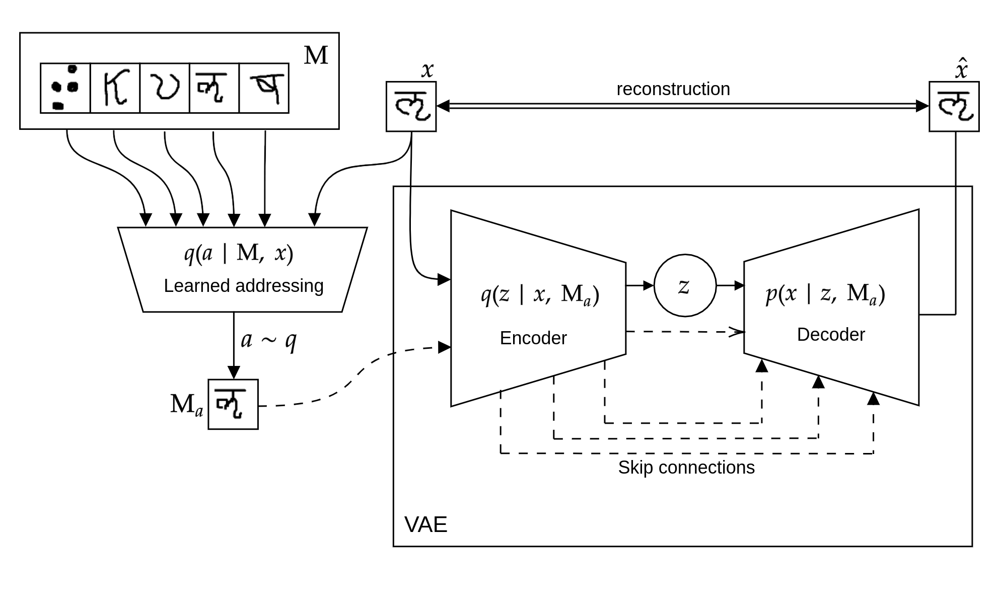
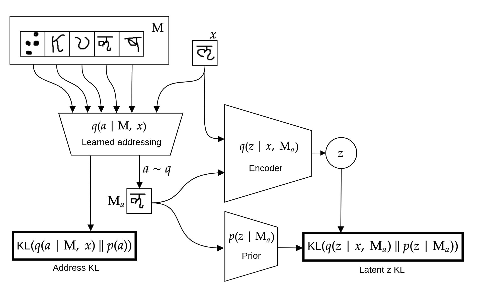
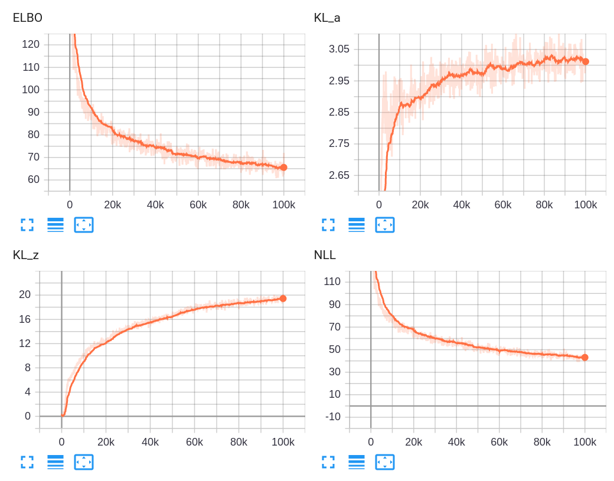

## Variational Memory Addressing

This repo provides an easy to follow implementation of Variational Memory Addressing VAE [[1](https://arxiv.org/abs/1709.07116)]. 






### Description

VMA-VAE is a variational autoencoder model augmented with address network which helps the generation process by retrieving a "similar" object from memory which is encoded along with the original object but with much wider bottleneck. Addressing variable acts as an additional discrete latent variable here. It is trained using multi-sample low variance REINFORCE-like estimator for the variational objective called VIMCO [[2](https://arxiv.org/abs/1602.06725)]. Higher bottleneck of supporting object results in much tighter variational bound which generalizes well on larger sizes of memory.

### Results

Here we report evidence lower bound (ELBO) calculated with 1000 importance samples on [Omniglot](https://github.com/brendenlake/omniglot) dataset for different sizes of memory and number of character classes (`C`) in memory. Note that the results we are comparing to are present in Table 1 of [[1](https://arxiv.org/abs/1709.07116)]. We use standard split provided by Omniglot (i.e. background/evaluation sets).

<table>
    <thead>
        <tr>
            <th>C</th>
            <th>M size</th>
            <th>ELBO@1000</br> (Ours)</th>
            <th>ELBO@1000</br> (Bornschein et al.)</th>
        </tr>
    </thead>
    <tbody>
        <tr>
            <td rowspan=7>1</td>
            <td>1</td>
            <td>85.2</td>
            <td>86.5</td>
        </tr>
        <tr>
            <td>2</td>
            <td>79.8</td>
            <td>83.0</td>
        </tr>
        <tr>
            <td>3</td>
            <td>77.5</td>
            <td>79.6</td>
        </tr>
        <tr>
            <td>4</td>
            <td>76.2</td>
            <td>79.0</td>
        </tr>
        <tr>
            <td>5</td>
            <td>75.3</td>
            <td>76.5</td>
        </tr>
        <tr>
            <td>10</td>
            <td>73.2</td>
            <td>76.2</td>
        </tr>
        <tr>
            <td>19</td>
            <td>71.8</td>
            <td>73.9</td>
        </tr>
        <tr>
            <td rowspan=7>2</td>
            <td>1</td>
            <td>85.2</td>
            <td>87.5</td>
        </tr>
        <tr>
            <td>2</td>
            <td>82.7</td>
            <td>83.3</td>
        </tr>
        <tr>
            <td>3</td>
            <td>80.1</td>
            <td>80.9</td>
        </tr>
        <tr>
            <td>4</td>
            <td>78.5</td>
            <td>79.3</td>
        </tr>
        <tr>
            <td>5</td>
            <td>77.5</td>
            <td>79.1</td>
        </tr>
        <tr>
            <td>10</td>
            <td>75.2</td>
            <td>77.0</td>
        </tr>
        <tr>
            <td>19</td>
            <td>73.5</td>
            <td>75.0</td>
        </tr>
    </tbody>
</table>



The results here is slightly better probably due to possibly different architecture of CNNs which wasn't described precisely in the paper. However, I did my best to match the architecture with the description. Other results from paper [[1](https://arxiv.org/abs/1709.07116)] (e.g. from Figure 5) were obtained from different split with much lower test size (introduced [here](https://github.com/yburda/iwae)) therefore the results have much lower bound compared to the ones here.

### Reproducing results

Results here can be reproduced easily using a lightweight docker image which is here only for reproducibility convenience: 


```
git clone https://github.com/artemZholus/variational_memory_addressing && cd variational_memory_addressing

docker build -t vma .

# train model
docker run --rm --shm-size=10G --gpus all -it -w /code -v $(pwd):/code vma python run.py --config configs/vma.yaml --train
# calculate metrics
docker run --rm --shm-size=10G --gpus all -it -w /code -v $(pwd):/code vma python run.py --config configs/vma.yaml --test
```

### Repository structure

Full model implementation is present in `models/vma/` dir. It is split into encoder, decoder, prior and main model files for convenience. For experimental flexibility, convolutional parts of encoder and decoder are also separated into `autoencoders/omniglot/vma.py`. Train loop and experiment config parsers are in `trainer.py` and `parsers.py`.

An experiment config is comprised of train, validation, and test data specs. It's main parameters are: `timesteps` which is the size of memory; `max_img_per_class` and `max_batch_cls` which define maximum number of images per class in memory and maximum number of image classes in memory (mutually exclusive); `exact` tells whether the observed value will be equal to the corresponding maximum (e.g. with `max_batch_cls: 4` and `exact: False` we'll have *up to* 4 classes of images in memory, for `exact: True` it will be exactly 4 classes) 

### References

[1] Jörg Bornschein, Andriy Mnih, Daniel Zoran, Danilo J. Rezende. *Variational Memory Addressing in Generative Models* (https://arxiv.org/abs/1709.07116).

[2] Andriy Mnih, Danilo J. Rezende. *Variational inference for Monte Carlo objectives* (https://arxiv.org/abs/1602.06725).
